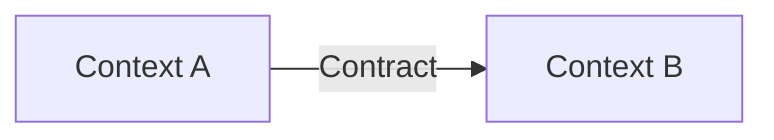

# Domain Design — <Project>

## 1. Purpose and scope

## 2. Domain overview

### 2.1 Business capabilities

### 2.2 Subdomain classification

| Subdomain | Type | Why |
|---|---|---|

## 3. Ubiquitous language

| Term | Context | Meaning | Avoid/conflicts |
|---|---|---|---|

## 4. Bounded contexts

### <Context Name>

**Purpose**

**Owns**

**Does not own**

**Key invariants**

**Inbound contracts**

**Outbound contracts**

## 5. Context map

| Upstream | Downstream | Relationship | Contract | ACL? |
|---|---|---|---|---|

## 6. Tactical model

### <Aggregate Name>

**Aggregate root**

**Entities**

**Value objects**

**Invariants**

**Commands**

**Domain events**

**Repository**

**Concurrency/consistency notes**

## 7. Domain services / policies / process managers

## 8. External systems and ACLs

## 9. Known extension seams

## 10. Deferred decisions

## 11. Domain decisions

| ID | Decision | Rationale | Status |
|---|---|---|---|
| DD-001 | | | Proposed |

## 12. Architecture constraints derived from the domain
