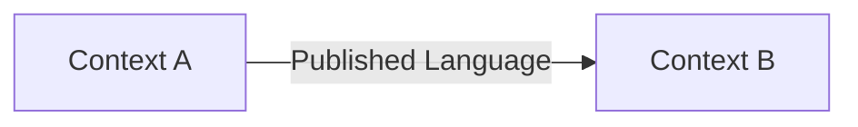

# Domain Design — <Project>

> Compatibility/composite template.
>
> For non-trivial projects, prefer three separate artifacts:
>
> - `strategic-domain-model.md`
> - `tactical-domain-model.md`
> - `release-<name>-domain-profile.md`
>
> Use this file as an index/summary, or as a single-file format only for a small project. Even in a single file, preserve the same semantic separation.

## 1. Authority and artifact map

| Layer | Artifact | Owns |
|---|---|---|
| Strategic Domain | | Long-lived business spine, subdomains, ubiquitous language, bounded contexts, context relationships |
| Tactical Domain | | Aggregates, Entities, Value Objects, invariants, Domain Events, business states |
| Release / Scope Profile | | Current product slice and temporary restrictions |
| Architecture | | Application coordination, persistence, reliability, runtime/infrastructure mechanisms |

## 2. Strategic Domain summary

### 2.1 Long-lived business spine

### 2.2 Business capabilities

### 2.3 Subdomain classification

| Subdomain | Core / Supporting / Generic | Why |
|---|---|---|

### 2.4 Ubiquitous language

| Term | Context | Meaning | Avoid/conflicts |
|---|---|---|---|

### 2.5 Bounded contexts and ownership

| Context | Purpose | Owns | Does not own |
|---|---|---|---|

### 2.6 Context map

| Upstream | Downstream | Relationship | Contract | ACL? |
|---|---|---|---|---|

## 3. Tactical Domain summary

| Context | Aggregate Root | Invariant/lifecycle justification |
|---|---|---|

### Important non-Aggregate concepts

List transient observations, Value Objects, snapshots, derived intents, query views, or application/runtime coordination records that must **not** be promoted into Aggregates.

### Domain Services / Policies

### Domain Events

### Integration Events / Published Language

### Business state machines

## 4. Release / Scope Profile summary

| Variation axis | Current release choice | Long-lived invariant? |
|---|---|---|

Include:
- active/inactive contexts
- platform/source/action variants
- current lifecycle shortcuts
- attempt/retry limits
- audience/selection rules
- account/tenant restrictions
- current non-goals
- deferred decisions

## 5. Architecture boundary

Explicitly list architecture-owned mechanisms so they do not leak back into the domain model.

Typical examples:
- permits/leases/runtime slots
- worker generations/fencing
- technical manifests/materialization progress
- Unit of Work/transaction protocol
- crash/restart recovery
- queue/scheduler/process/browser/IPC mechanics
- database/vendor DTO details

## 6. Deferred decisions

| Decision | Owning layer | Why deferred | Revisit trigger |
|---|---|---|---|

## 7. Domain decisions

| ID | Layer | Decision | Rationale | Status |
|---|---|---|---|---|
| DD-001 | Strategic / Tactical / Release | | | Proposed |

## 8. Architecture constraints derived from the domain

Summarize what Architecture must preserve without prescribing the technical mechanism unless already decided.
